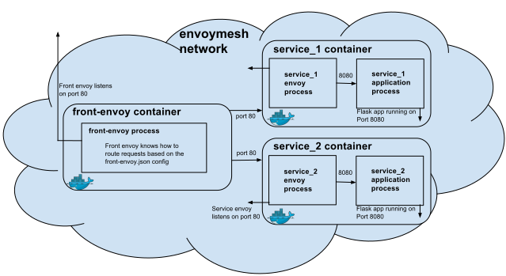

# envoy 101

## Front proxy

服务的拓扑结构如下：



共3个容器：

* front-envoy

前端代理服务，监听80，并将`/service/1`转到`service1`，`/service/2`转到`service2`。参考[front-proxy/front-envoy.yaml](https://github.com/envoyproxy/envoy/blob/v1.8.0/examples/front-proxy/front-envoy.yaml)。

```
  clusters:
  - name: service1
    connect_timeout: 0.25s
    type: strict_dns
    lb_policy: round_robin
    http2_protocol_options: {}
    hosts:
    - socket_address:
        address: service1  # 转到service1
        port_value: 80
```

* service1

容器有2个进程：一是服务程序本身，参考[front-proxy/service.py](https://github.com/envoyproxy/envoy/blob/v1.8.0/examples/front-proxy/service.py)；另外一个是`envoy`进程，将请求转给本地的`127.0.0.1:8080`，及同容器的`service.py`进程，参考[front-proxy/service-envoy.yaml](https://github.com/envoyproxy/envoy/blob/v1.8.0/examples/front-proxy/service-envoy.yaml).

```
# docker exec -it frontproxy_service1_1 ps -ef
PID   USER     TIME  COMMAND
    1 root      0:00 {start_service.s} /bin/sh /usr/local/bin/start_service.sh
    8 root      0:00 python3 /code/service.py
    9 root      0:00 envoy -c /etc/service-envoy.yaml --service-cluster service
   40 root      0:00 /usr/bin/python3 /code/service.py
   50 root      0:00 ps -ef
```

* service2

与`service1`类似。

* Run envoymesh

```
# examples/front-proxy
# docker-compose up -d
Creating frontproxy_service1_1 ... 
Creating frontproxy_front-envoy_1 ... 
Creating frontproxy_service2_1 ... 
Creating frontproxy_service1_1
Creating frontproxy_front-envoy_1
Creating frontproxy_front-envoy_1 ... done
```

* 访问service

`service1`:

```
# curl -v http://localhost:8000/service/1
* About to connect() to localhost port 8000 (#0)
*   Trying 127.0.0.1...
* Connected to localhost (127.0.0.1) port 8000 (#0)
> GET /service/1 HTTP/1.1
> User-Agent: curl/7.29.0
> Host: localhost:8000
> Accept: */*
> 
< HTTP/1.1 200 OK
< content-type: text/html; charset=utf-8
< content-length: 91
< server: envoy
< date: Wed, 12 Dec 2018 03:24:03 GMT
< x-envoy-upstream-service-time: 1
< 
Hello from behind Envoy (service 1)! hostname: b13f821fab99 resolvedhostname: 192.168.32.4
* Connection #0 to host localhost left intact
```

`service2`:

```
# curl http://localhost:8000/service/2   
Hello from behind Envoy (service 2)! hostname: dff5190ced52 resolvedhostname: 192.168.32.2
```


## 测试负载均衡

```
# docker-compose scale service1=3
WARNING: The scale command is deprecated. Use the up command with the --scale flag instead.
Starting frontproxy_service1_1 ... done
Creating frontproxy_service1_2 ... 
Creating frontproxy_service1_3 ... 
Creating frontproxy_service1_2 ... done
Creating frontproxy_service1_3 ... done
```

每次返回不同的IP：

```
# curl http://localhost:8000/service/1
Hello from behind Envoy (service 1)! hostname: b13f821fab99 resolvedhostname: 192.168.32.4
# curl http://localhost:8000/service/1
Hello from behind Envoy (service 1)! hostname: f56cad7c99d5 resolvedhostname: 192.168.32.6
# curl http://localhost:8000/service/1
Hello from behind Envoy (service 1)! hostname: 7820b29f3c10 resolvedhostname: 192.168.32.5
```


## Zipkin Tracing

```
# cd examples/zipkin-tracing
# docker-compose up -d
Creating zipkintracing_front-envoy_1 ... 
Creating zipkintracing_service1_1 ... 
Creating zipkintracing_zipkin_1 ... 
Creating zipkintracing_service2_1 ... 
Creating zipkintracing_front-envoy_1
Creating zipkintracing_service1_1
Creating zipkintracing_service2_1
Creating zipkintracing_zipkin_1 ... done
```

相对`front-proxy`示例，多了一个`zipkin`容器。


## Refs

* [envoy doc: front proxy](https://www.envoyproxy.io/docs/envoy/latest/start/sandboxes/front_proxy)