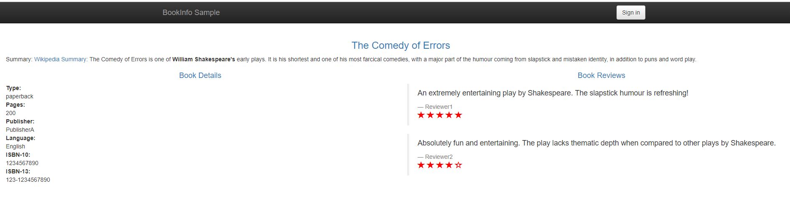

# bookinfo example

istio bookinfo 示例。

* 使用自动注入sidecar

先部署好istio各个组件。

```
# kubectl label namespace default istio-injection=enabled
# kubectl apply -f samples/bookinfo/platform/kube/bookinfo.yaml
service/details created
deployment.extensions/details-v1 created
service/ratings created
deployment.extensions/ratings-v1 created
service/reviews created
deployment.extensions/reviews-v1 created
deployment.extensions/reviews-v2 created
deployment.extensions/reviews-v3 created
service/productpage created
deployment.extensions/productpage-v1 created

# kubectl get svc -o wide 
NAME          TYPE        CLUSTER-IP       EXTERNAL-IP   PORT(S)    AGE     SELECTOR
details       ClusterIP   10.254.150.100   <none>        9080/TCP   3m28s   app=details
kubernetes    ClusterIP   10.254.0.1       <none>        443/TCP    6d23h   <none>
productpage   ClusterIP   10.254.173.81    <none>        9080/TCP   3m28s   app=productpage
ratings       ClusterIP   10.254.138.198   <none>        9080/TCP   3m28s   app=ratings
reviews       ClusterIP   10.254.254.240   <none>        9080/TCP   3m28s   app=reviews


# kubectl get pods -o wide
NAME                            READY   STATUS    RESTARTS   AGE     IP              NODE         NOMINATED NODE
details-v1-876bf485f-zswkn      2/2     Running   0          3m55s   192.168.9.217   kube-node1   <none>
productpage-v1-8d69b45c-l6grt   2/2     Running   0          3m55s   192.168.9.221   kube-node1   <none>
ratings-v1-7c9949d479-6bq86     2/2     Running   0          3m55s   192.168.9.218   kube-node1   <none>
reviews-v1-85b7d84c56-tkn5d     2/2     Running   0          3m55s   192.168.6.19    kube-node2   <none>
reviews-v2-cbd94c99b-wgvfj      2/2     Running   0          3m55s   192.168.9.219   kube-node1   <none>
reviews-v3-748456d47b-fmq2v     2/2     Running   0          3m55s   192.168.9.220   kube-node1   <none>
```

* 创建gateway

```
# kubectl apply -f samples/bookinfo/networking/bookinfo-gateway.yaml
gateway.networking.istio.io/bookinfo-gateway created
virtualservice.networking.istio.io/bookinfo created

# kubectl get gateway
NAME               AGE
bookinfo-gateway   33s
```

获取`istio-ingressgateway`的IP:

```
# kubectl get svc istio-ingressgateway -n istio-system
NAME                   TYPE           CLUSTER-IP     EXTERNAL-IP      PORT(S)                                                                                                                   AGE
istio-ingressgateway   LoadBalancer   10.254.99.30   172.17.240.240   80:31380/TCP,443:31390/TCP,31400:31400/TCP,15011:32324/TCP,8060:32683/TCP,853:30629/TCP,15030:31109/TCP,15031:30807/TCP   18h

# export INGRESS_HOST=$(kubectl -n istio-system get service istio-ingressgateway -o jsonpath='{.status.loadBalancer.ingress[0].ip}')
# export INGRESS_PORT=$(kubectl -n istio-system get service istio-ingressgateway -o jsonpath='{.spec.ports[?(@.name=="http2")].port}')
# export SECURE_INGRESS_PORT=$(kubectl -n istio-system get service istio-ingressgateway -o jsonpath='{.spec.ports[?(@.name=="https")].port}')
```

检查应用是否部署正常：

```
# cat test.sh 
#!/bin/bash
export INGRESS_HOST=$(kubectl -n istio-system get service istio-ingressgateway -o jsonpath='{.status.loadBalancer.ingress[0].ip}')
export INGRESS_PORT=$(kubectl -n istio-system get service istio-ingressgateway -o jsonpath='{.spec.ports[?(@.name=="http2")].port}')
export SECURE_INGRESS_PORT=$(kubectl -n istio-system get service istio-ingressgateway -o jsonpath='{.spec.ports[?(@.name=="https")].port}')
export GATEWAY_URL=$INGRESS_HOST:$INGRESS_PORT

echo "GATEWAY URL: $GATEWAY_URL"

curl -o /dev/null -s -w "%{http_code}\n" http://${GATEWAY_URL}/productpage

# ./test.sh 
GATEWAY URL: 172.17.240.240:80
200
```



## Refs

* [Bookinfo Application](https://istio.io/docs/examples/bookinfo/)